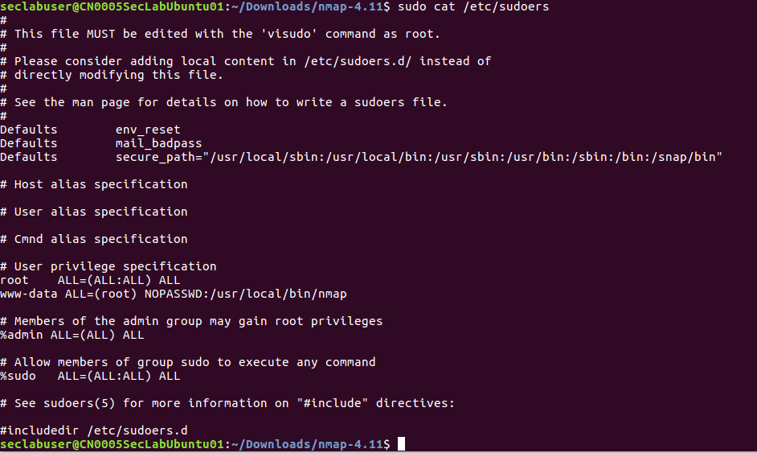

# Linux Privilege Escalation using Sudo Rights

reference : <https://www.hackingarticles.in/linux-privilege-escalation-using-exploiting-sudo-rights/>

For privilege escalation, don't forget to check root permission for any user to execute any file or command.

in Linux/Unix, /etc/sudoers is the configuration file to define the root rights for users and groups to run commands as root or any one else. 

# How To Find All Sudo Users In Your Linux System

<https://www.ostechnix.com/find-sudo-users-linux-system/>

# understanding sudoer syntax

<http://toroid.org/sudoers-syntax>

```
User Host = (Runas) Command
```

as an example:

```
%adm ALL=(ALL) NOPASSWD: ALL
```

This means “any user in the adm group on any host may run any command as any user without a password”. The first ALL refers to hosts, the second to target users, and the last to allowed commands. A password will be required if you leave out the "NOPASSWD:".

## Example: misconfigure the sudoers file for www-data to run Nmap without password

Edit the sudoers to grant www-data the root privilege to run `nmap` without password.

 


After that, you can install `nmap` which allows for spawn a shell, so www-data can get root access.

