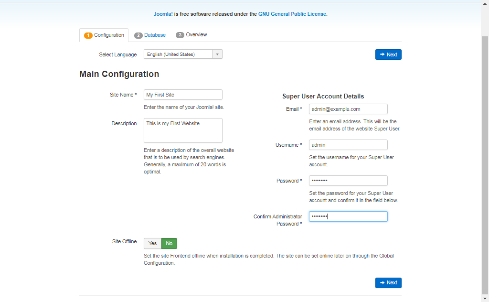
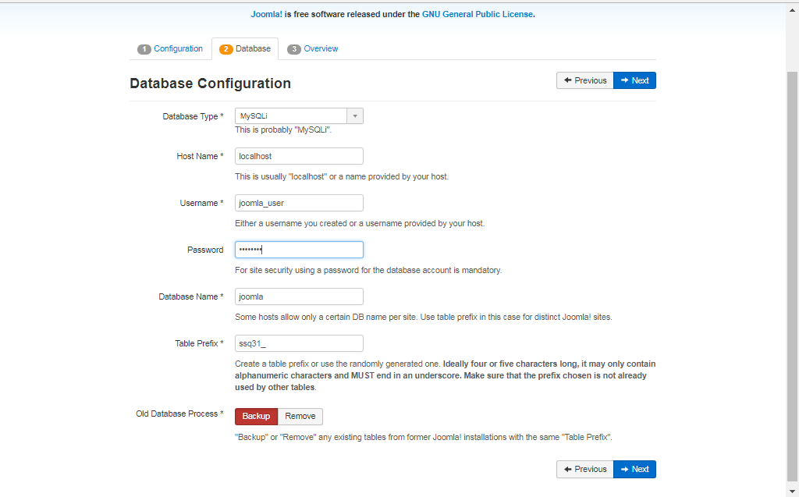
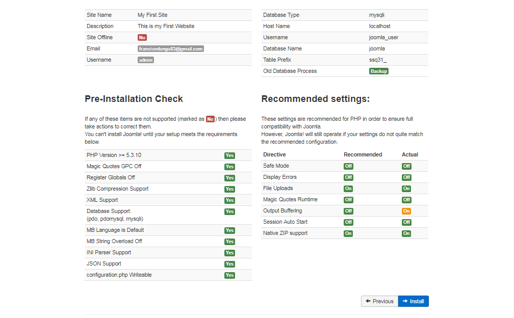
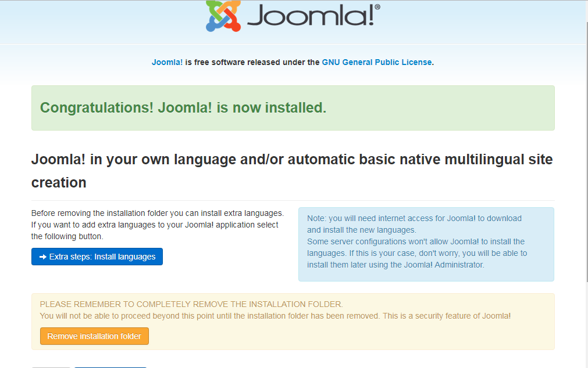
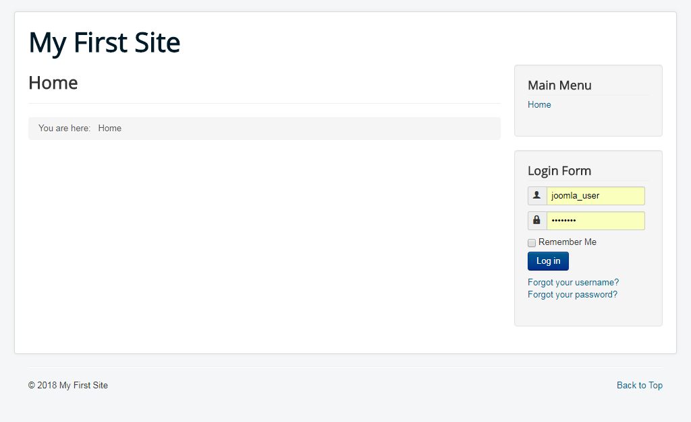

## install Joomla on an Ubuntu 

source: <https://hostadvice.com/how-to/how-to-install-joomla-on-an-ubuntu-18-04-vps-or-dedicated-server/>. 

Joomla is the second most widely used Content Management System (CMS) besides WordPress. The open-source software is programmed in PHP using Object Oriented techniques that make it easy to maintain.

Joomla stores its data in MySQL or MariaDB, and it is used by millions of programmers worldwide to create mobile-ready and user-friendly websites. It has thousands of features and designs, and these make it a good bet for building professional sites.

In this article, we will show you how to install Joomla on your Ubuntu 18.04 Virtual Private Server (VPS).

### Prerequisites

- A non-root user with sudo privileges
- A VPS or dedicated server hosting plan

> Special note: use HostAdvice's [VPS hosting reviews](https://hostadvice.com/hosting-services/vps/) and [dedicated hosting reviews](https://hostadvice.com/hosting-services/dedicated-server/) to get the best service at the best prices.

## Step 1: Install Apache

First, update the index on the Ubuntu repository:

1. $ sudo apt-get update

Then, install Apache using the command below

1. $ sudo apt-get install apache2

## **Step 2: Install MySQL**

Joomla stores data in a MySQL database. So you need to install MySQL server  as well:

1. $ sudo apt-get install mysql-server

You should enter a strong password for the root user when prompted to do so.

Since the default MySQL installation is not secure, run the command below to remove anonymous users and test databases:

1. $ sudo mysql_secure_installation

Press **Y** or **N** and hit Enter as indicated below when prompted  to answer the questions that follow:

- Setup VALIDATE PASSWORD plugin? [Y/N] N
- Change root password? [Y/N] N
- Remove anonymous users? [Y/N] Y
- Disallow root login remotely? [Y/N] Y
- Remove test database and access to it? [Y/N] Y
- Reload privilege tables now? [Y/N] Y

We now need to create a database where Joomla will store data:

First, log in on the MySQL Command Line Interface(CLI) using the commands below:

1. $ sudo mysql -u root -p

Enter your root password and hit **Enter.**

Next create the database, user and assign the right privileges using the commands below:

1. mysql>CREATE DATABASE joomla;
2. mysql>GRANT ALL PRIVILEGES on joomla.* to 'joomla_user'@'localhost' identified by 'PASSWORD';
3. mysql>FLUSH PRIVILEGES;
4. mysql>QUIT;

Remember to replace **‘joomla_user’** with your preferred value. Also, you **should** set a strong password for the user.

## Step 3: Install PHP

Joomla is written in PHP – a server side general purpose scripting language.  So, you need to install PHP as well together with associated modules tailored for Apache web server using the commands below:

1. $ sudo apt-get install php libapache2-mod-php
2. $ sudo apt-get install php-cli php-common php-mbstring php-gd php-intl php-xml php-mysql php-zip php-curl php-xmlrpc

Press **Y** and hit **Enter** when prompted to confirm the installation

## Step 4: Install Joomla

Since the download will be a zip archive, you should begin by installing the unzip tool.

1. $ sudo apt-get install unzip

Next, cd to the ‘/tmp’ directory and download the latest version of Joomla from the official website.

1. $ cd /tmp

1. $ wget https://downloads.joomla.org/cms/joomla3/3-8-10/Joomla_3-8-10-Stable-Full_Package.zip

Joomla will be downloaded and stored under the archive file ‘**Joomla_3-8-10-Stable-Full_Package.zip’**

We need to unzip this file and copy it to the root of our website probably under a directory name like **‘joomla’**.  You can use any name for this.

So first, we make the directory

1. $ sudo mkdir /var/www/html/joomla

Unzip the file

1. $ sudo unzip Joomla_3-8-10-Stable-Full_Package.zip  -d /var/www/html/joomla

## Step 5: Configure Joomla and Assign the Right File Permissions

The default Joomla installation comes with a **‘htaccess.txt’** which we should copy to create a **‘.htaccess’** file. Use the commands below to do this:

1. $ sudo cp /var/www/html/joomla/htaccess.txt /var/www/html/joomla/.htaccess

In order for Apache to be able to access Joomla files, we need to set the right file permissions using the commands below:

1. $ sudo chown -R www-data.www-data /var/www/html/joomla
2. $ sudo chmod -R 755 /var/www/html/joomla

Restart Apache for all PHP settings to take place

1. $ sudo systemctl restart apache2

## Step 6: Finalize Joomla Installation via a browser

Next navigate to the URL **‘http://example.com/joomla’** on your browser. Remember to replace ‘example.com’ with your domain name or public IP address of your server

1. http://example.com/joomla

Then enter your site name, description , email address and password that you want to create for the administrator.

Then, click ‘**Next’** on the bottom right to proceed.

On the page that follows, enter the database details that you created above and click **‘Next’** to proceed

Then click **‘Install’** on the next screen.

[]

The setup wizard will finalize the installation and you will get a congratulations message:

Click on the **‘Remove Installation Folder’.**

## **Step 7: Test the Installation**

Navigate to the URL **‘http://example.com/joomla’** and remember to replace **‘example.com’** with your domain name or public IP address. If the installation was completed successfully, you should see the home page.

1. http://example.com/joomla

## Conclusion

We have accomplished installing Joomla on Ubuntu 18.04 server. You can now start posting content or probably install a new theme to make your website look more professionals. Joomla is a great content management application that you can utilize to create beautiful websites. if you have followed this guide step-by-step, your Joomla site should be up and running.